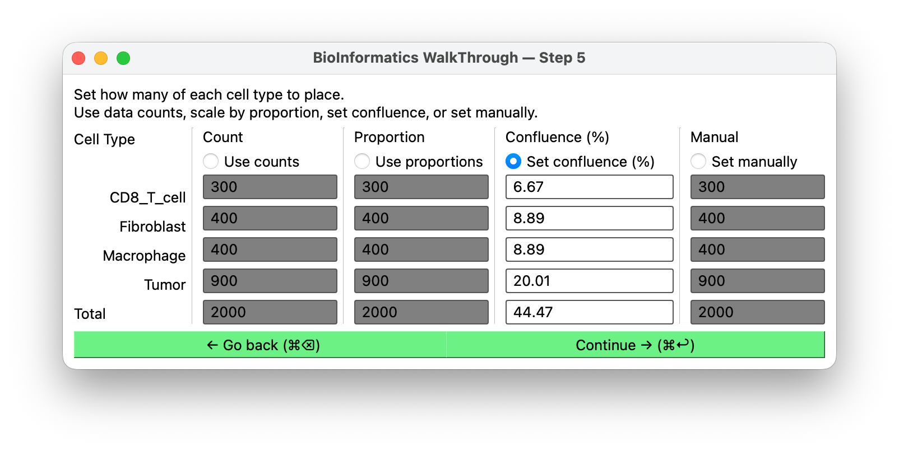

# Cell counts

**Shown when:** you are **not** using spatial data. With spatial data, one cell is placed per
data row and this screen is skipped.

## The question

How many cells of each type to place. The four modes sit side by side as columns — pick one
with its radio button.

<figure markdown>
  
  <figcaption>Confluence selected: its column is editable and pre-populated from the current
  counts, while the other three gray out.</figcaption>
</figure>

## The four modes

### Use data counts

Place exactly as many cells of each type as the data contains. If your file has 3,412 tumor
cells and 806 T cells, that is what you get.

Use this when the dataset size is already the population size you want to simulate.

### Scale by proportion

Keep the observed proportions, change the total. You set a total; BIWT divides it among the
types in the same ratios as the data.

A 40,000-cell scRNA-seq experiment is more agents than most simulations want; asking for
4,000 in the same proportions gives you a representative population at a tractable size.

### Set confluence (%)

Specify how much of the domain area the cells should cover, as a percentage. BIWT works
backwards from the domain area and a per-cell area to a count.

Confluence is the natural currency when what you care about is tissue density rather than an
absolute number — "start at 60% confluent" is a statement about the biology; "start with
7,318 cells" is a statement about a specific domain size. The fields are pre-populated from
your current counts.

### Set manually

Type a count per type. Total control, no coupling between types.

Use this for designed experiments: a defined effector-to-target ratio, a single seeded
metastasis, a sensitivity sweep over one population's size.

## Rules

**Zero is allowed, and it is not the same as deleting.** A count of zero means *define this
cell type, but place none of it*: the type still reaches the host — in `cell_type_map`, and
with whatever [cell template](cell-templates.md) you assigned it — it just contributes no
rows to the coordinates. That is how you pull a phenotype into your model without seeding any
of those cells, useful when the population is meant to appear later, through division or
differentiation, rather than at t = 0.

[Deleting the type](edit-cell-types.md) is the other choice: it removes the type outright, so
the host never hears about it.

Every type may be zero if you want, which gives you a config full of cell definitions and an
empty positions file.

At the [positions](positions.md) screen a zero-count type arrives already grayed out, so it
will not hold up **Continue**.

**Counts interact with the domain.** A confluence figure is meaningless without a domain
area, and a large manual count in a small domain produces heavy overlap. If you are also
changing the domain, set it in [the domain editor](domain.md) first.

## Next

[Positions →](positions.md).
