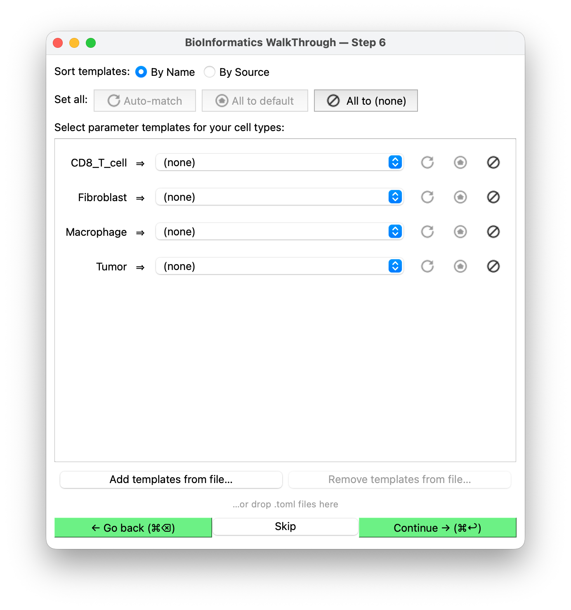
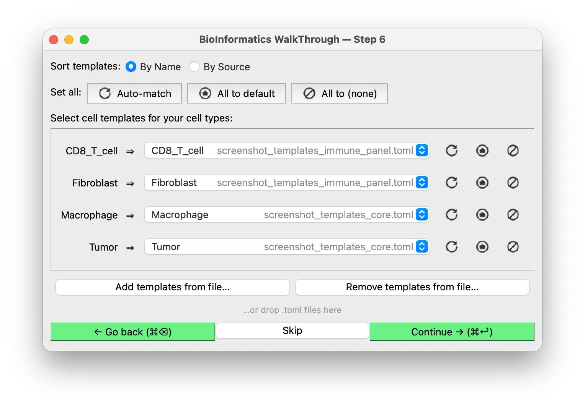
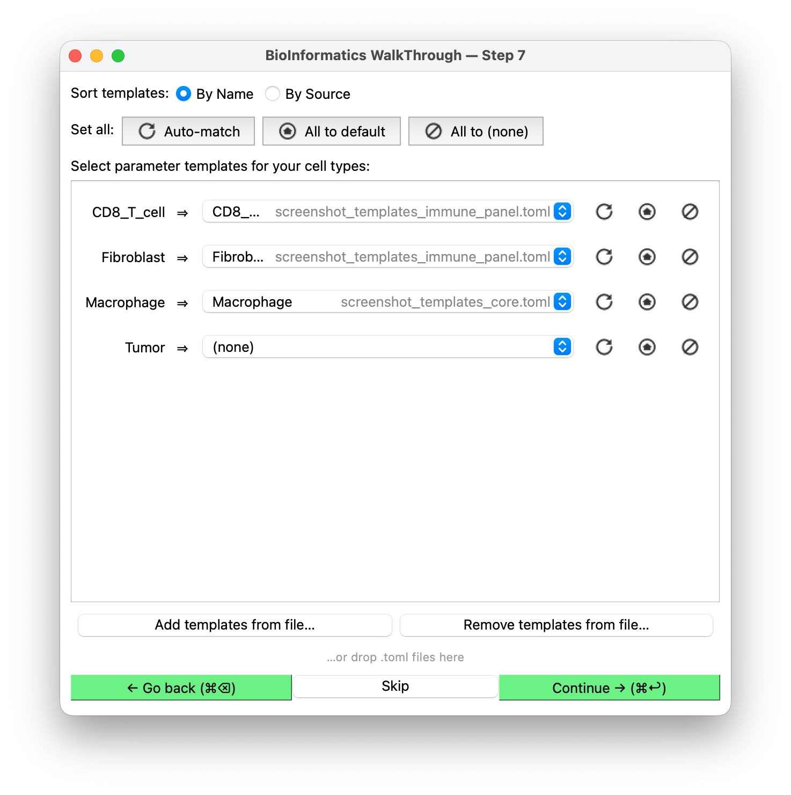

# Cell parameters

**Shown when:** always — the last step before BIWT hands back its result.

## The question

Each of your cell types can be assigned a **parameter template**: a block of text describing
how that cell behaves. For a PhysiCell host that block is a `<phenotype>` element — motility,
mechanics, secretion, cycle, death rates — but BIWT never looks inside it.

One dropdown per cell type, plus **(none)** at the top of every dropdown. **You can click
Continue straight away, and you can click Skip instead** — this step is never required. Skip
leaves every type unassigned; so does picking `(none)` for individual types.

<figure markdown>
  
  <figcaption>With nothing loaded, every type sits on <strong>(none)</strong> and the actions that
  need a library are disabled. This is a complete, valid answer — <strong>Continue</strong> and
  <strong>Skip</strong> both hand back an empty set.</figcaption>
</figure>

## Where the templates come from

**BIWT ships none.** Templates reach the dropdowns two ways:

**From the host.** An application embedding BIWT passes template files when it builds the widget,
so they are present before you arrive — listed on the landing screen, where you can drop any of
them.

**From the landing screen.** The **Cell parameter templates** list on the first screen is the
library every import starts from, so a library you work from all session is chosen once rather
than at every run. The host's files seed it, and **Remove file…** takes any of them off for good.

**From the wizard.** The **Add templates from file…** button at the bottom of the screen loads
template files on the spot, whether or not the host supplied any — pick several at once, or drop
them onto the window. Load them at any point: the types you have not picked for yourself re-match
against whatever the library now holds (see below). **Remove templates from file…** drops a file
again, including the host's own library if you would rather work from yours.

!!! note "Running BIWT remotely"
    Through a remote session — a Galaxy interactive tool, say — dropping will not work: your files
    are not on the machine BIWT is running on. The button always works; it browses that machine.

**From the host's existing cell types.** Cell types the application already defines appear too,
tagged with its name — `Tumor (Studio)`. Picking one assigns no template; it says *this is the cell
type you already have*, and the host decides what to do about it. Where a name exists both ways,
the host's wins.

Removing a file here removes it from this run only. The landing screen's list is what the next
import starts from, so remove it there to be rid of it for good.

If nothing is supplied and you load nothing, every dropdown offers only `(none)`.

Either way the file is TOML, mapping a template name to its content. For a PhysiCell host it
looks like this:

```toml
"My Cell Type" = """
<phenotype>
  <cycle code="5" name="live">
    ...
  </cycle>
  ...
</phenotype>
"""
```

See [templates and name matching](../integration/templates-and-matching.md) for how a host
wires that up, and what it gets back.

## What gets pre-selected

Each type starts on a candidate whose **name matches the type** — case-insensitive, then a
similarity match, preferring the host's own cell types where both name it equally well. Failing
that, whatever is named `default`: the host's if it has one, else the library's. Failing that,
`(none)`.

<figure markdown>
  
  <figcaption>Two libraries loaded, every type matched by name. The file each template came from
  is right-aligned in its own column, so the sources line up down the list rather than trailing
  each name. With a single library loaded the column is dropped — there is nothing to tell
  apart.</figcaption>
</figure>

Three actions redo that for you, each with the same icon in two places: the **Set all** row at the
top applies it to every cell type, the small button beside a dropdown to that type alone.

<!-- The icons below are copies of the package's own, kept byte-identical by a
     test. After editing an icon: cp src/biwt/gui/icons/action_*.svg docs/assets/icons/ -->

| | Action | What it does |
|:-:|---|---|
| { width="20" } | **Auto-match** | Re-runs the matching above, overriding your picks |
| { width="20" } | **Assign default** | Assigns whatever is named `default` — the host's, else the library's |
| { width="20" } | **Assign (none)** | Clears the assignment |

<figure markdown>
  
  <figcaption><strong>(none)</strong> on one type only. Unassigned types are simply absent from
  the result, so this is how you hand back some templates and not others.</figcaption>
</figure>

If two sources offer the same name — `tumor` in one library and `Tumor` in another, or one of them
the host's own cell type — that row is marked with an **ⓘ**. Hover it to see who else defines the
name. Nothing is hidden: each is listed separately in the dropdown with its source. Click the **ⓘ**
to dismiss it.

**Set all → Assign (none)** is Skip without leaving the step. **Auto-match** is greyed out if no
templates are loaded at all, and **Assign default** if nothing is named `default`, or if two loaded
files each define one and the host does not — then there is no single default to mean, so pick the
one you want from the dropdown.

**Changing the loaded files re-matches the types you have not touched.** If a new file names a
better match for a type whose dropdown you never used, that type takes it; a type you chose for
yourself keeps your choice, including an explicit `(none)`.

Removing a file works the same way, except for rows that were using it: their template no longer
exists, so there is no choice left to preserve and they re-match with the rest rather than
quietly picking up some other template.

**Auto-match** resets that, at either scope: a row you auto-match counts as untouched again.

Numbers in a name are treated as significant, so `M1 Macrophage` never matches
`M2 Macrophage`, nor `CD4 T Cell` a `CD8` one. A host can replace the whole rule by supplying
its own predicate (the `name_matches` argument to `create_biwt_widget`).

Pre-selection is a hint: nothing stops you assigning `Fibroblast` parameters to a type you named
something else.

!!! tip "Treat templates as starting points"
    A template library is generally literature-derived defaults, not calibrated parameters for
    your system. Expect to tune them in your config afterwards.

**Sort templates** reorders the dropdown entries by name, or groups them under a heading per
source file. Either way names sort case-insensitively — `default`, `Macrophage`, `t_cell`, `Tumor`.

With a single file loaded, entries show the bare template name. Once two or more are loaded every
entry is tagged with its source file. The host's own cell types are always tagged.

## What happens with your choices

Your selections come back to the host as
[`BiwtResult.cell_templates`][biwt.types.BiwtResult]: a mapping from final cell-type name to
`(path, name, content)` — the file the template came from, its name in that file, and its
content verbatim. Assembling a config out of that is the host's job; BIWT generates no XML.

Where you picked one of the host's own cell types, `path` is
[`HOST_SOURCE`][biwt.types.HOST_SOURCE] rather than a file and the content is empty.

Types left unassigned are **absent** from the mapping, so an empty mapping is a perfectly
normal result — that is what Skip produces.

## Next

[Finishing up →](result.md).
