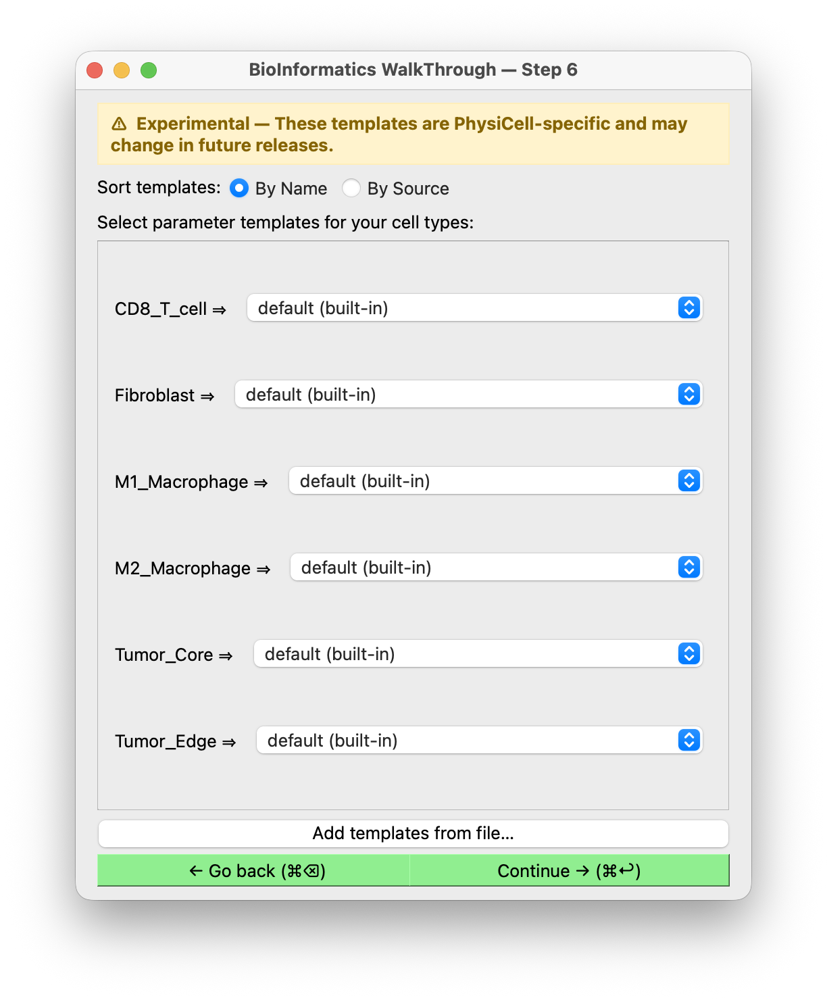

# Cell parameters

**Shown when:** always — the last step before BIWT hands back its result.

## The question

Each of your cell types can be assigned a **phenotype template**: a block of PhysiCell XML
describing how that cell behaves. Motility, mechanics, secretion, cycle, death rates.

<figure markdown>
  
  <figcaption>One dropdown per cell type. The suffix on each entry — <code>(built-in)</code>
  — shows where the template came from.</figcaption>
</figure>

This is optional in the sense that you can accept defaults, but it is where a table of
positions becomes a runnable model. Positions say where cells are; parameters say what they
do.

!!! warning "Marked experimental in the UI"
    The screen carries a banner: *these templates are PhysiCell-specific and may change in
    future releases.* That reflects a planned split — the PhysiCell templates are expected to
    move into a separate `biwt-physicell` package, leaving the base package
    framework-agnostic. Treat template *names* as unstable across releases.

**Sort templates** reorders the dropdown entries by name or by source, which matters once you
have loaded your own alongside the built-ins.

## The built-in templates

BIWT ships 29 templates:

| Group | Templates |
|---|---|
| Generic | `default`, `Other Tissue` |
| Epithelial / stromal | `Normal Epithelial`, `Normal Mesenchymal`, `Fibroblast` |
| Tumor | `Epithelial Tumor`, `Mesenchymal Tumor`, `Motile Tumor`, `Tumor`, `PD-L1lo Tumor`, `PD-L1hi Tumor` |
| Myeloid | `Macrophage`, `M0 Macrophage`, `M1 Macrophage`, `M2 Macrophage` |
| T cells | `CD8 T Cell`, `TH2 CD4 T Cell`, `PD-1lo CD4 T Cell`, and the four PD-1/CD137 CD8 combinations |
| Neural / layered tissue | `Apical`, `Pial`, `RGC`, `Layer 2`, `Layer 3`, `Layer 5`, `Layer 6` |

Pick the closest match for each type. The names are suggestive, not binding — nothing stops
you assigning `Fibroblast` parameters to a type you named something else, and for a cell type
with no good match, `default` is a reasonable neutral starting point.

!!! tip "Treat templates as starting points"
    These are literature-derived defaults, not calibrated parameters for your system. Expect
    to tune them in your config afterwards. Their value is giving you a complete, valid
    phenotype block to edit rather than a blank one to fill in.

## Supplying your own templates

Two routes, and you do not need to be the host to use the first one.

**From the wizard.** The **Add templates from file…** button at the bottom of the screen loads
a template file on the spot. Your templates then appear in every dropdown alongside the
built-ins, distinguished by their source suffix.

**From the host.** An application embedding BIWT can pass template files at launch through
[`BiwtInput.extra_cell_template_paths`][biwt.types.BiwtInput], so they are always present
without the user loading anything.

Either way the file is TOML, mapping a template name to a PhysiCell phenotype XML block:

```toml
"My Cell Type" = """
<phenotype>
  <cycle code="5" name="live">
    ...
  </cycle>
  ...
</phenotype>
"""
```

This is the supported way to use your own parameter database without waiting for BIWT to add
it — see [embedding BIWT](../integration/api-contract.md) for how a host wires it up.

## What happens with your choices

Selected templates are collected and, at the [finish step](result.md), assembled into a
complete PhysiCell settings XML: the standard scaffold sections, your domain, and a
`<cell_definitions>` block containing one entry per cell type. That XML comes back to the
host as `BiwtResult.cell_definitions_xml`.

If you assign no templates, no XML is generated and the result carries positions only.

## Next

[Finishing up →](result.md).
