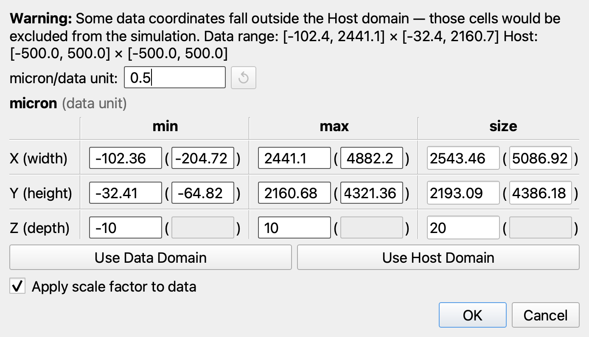

# The domain editor

Not a step — a dialog. It opens automatically the first time the
[positions](positions.md) screen appears if BIWT detects a mismatch, and you can open it any
time from that screen with **Domain Settings…**.

This is the most conceptually dense part of BIWT, because it is where two coordinate systems
meet.

<figure markdown>
  
  <figcaption>Opened automatically because the data extends past the host domain. The scale
  factor here was read from the file's Visium metadata; the host-unit values and their
  parenthesized data-unit mirrors stay in sync through it.</figcaption>
</figure>

## Data units vs host units

Your file has coordinates in whatever the instrument or analysis produced — often Visium
pixels, sometimes microns, sometimes an arbitrary embedding. BIWT calls these **data units**
and deliberately refuses to guess what they mean.

Your simulation has a domain in **host units** — microns, for PhysiCell.

These are not the same thing, and conflating them is the single most common way to get a
nonsensical initial condition. A Visium array spanning 8,000 pixels is not 8,000 µm across.

## The scale factor

The bridge between the two is one number: **host units per data unit**. The field is labeled
as a ratio using the host's own unit — `micron/data unit` for PhysiCell.

- For **10x Visium** data, BIWT reads µm-per-pixel out of the file and pre-fills it. A reset
  button (enabled only when you have changed the value) restores the file's number.
- For **everything else** — CSV, Seurat objects, non-Visium — there is no factor in the file.
  The field shows a `none found in file` placeholder and you supply one if you need it.

## Reading the grid

The grid has **one row per axis** and three columns — **min**, **max**, and **size**. So the
X row carries `X min`, `X max`, and the width; the Y row carries the height; the Z row the
depth. An axis' size sits beside the two bounds it spans, which is the whole point of the
layout: width belongs to x, and you should not have to hunt for it.

Every value appears twice. The plain field is in **host units**; the field in parentheses
beside it is the same value in **data units**. Host units lead because that is what the domain
is stored in and what your simulation consumes — the parenthesized number is the mirror.

The two stay in sync through the factor: edit either and the other updates (×F or ÷F). With no
factor set, every parenthesized field greys out and you work purely in host units.

Two buttons fill the grid for you:

- **Use Data Domain** — data units get your raw data bounds; host units get raw × factor
  (or raw, with no factor).
- **`Use <host> Domain`** — host units get the host's bounds verbatim.

### Why the Z row is greyed out on the right

Z carries the same cells as x and y, but its parenthesized fields are inert. The factor
converts a *measurement* in data units, and z is not one — it is a slab depth BIWT supplies
(±10 µm by default) for data that is really two-dimensional. There is nothing to convert, so
rather than leave a hole in the grid, the cells are shown switched off.

### Size is editable

The size fields are not just readouts. Editing a bound updates that axis' size, and typing a
size moves that axis' **maximum**, leaving the minimum where you put it. Other axes are
untouched. It works from either unit column.

Anchoring the minimum means exactly one bound moves, so the two are independently settable —
set `X min` to `-300`, then set the X size to `1000`, and you get `-300 … 700`. The size does
not drag the left edge back.

### The OK button is gated

**OK** stays disabled until every bound is a number and each minimum is below its maximum;
the offending fields are highlighted so you can see which ones are blocking. Equal bounds
count as invalid too — a zero-width axis has no area to place cells into.

**Cancel** is never gated, so a domain you cannot fix is always escapable.

## Apply scale factor to data

A checkbox, on by default.

- **On** — cells are scaled by the factor when placed. Data extent × F becomes the size the
  cells occupy.
- **Off** — cells are placed at their raw numeric extent, centered in the domain. The factor
  field stays live and the columns still sync; only placement ignores it.

Turning it off is useful when your coordinates are already in host units and the factor is
there for reference, or when you want to see the raw extent before deciding.

## Why the dialog opened by itself

BIWT compares the data extent to the domain, in host units, and classifies the fit:

| Classification | Meaning |
|---|---|
| **outside** | A data boundary exceeds the domain — cells would fall outside and be excluded |
| **small** | Data fits, but covers less than 50% of an axis or less than 50% of the 2D area — cells would be a small island in a large box |
| *(none)* | Close enough; no dialog |

The 50% threshold is a sensible default, chosen so that a dataset comfortably filling most of
the domain does not trigger the dialog.

No dialog appears when the domain came from the fallback default, since there is nothing
meaningful to compare against.

## Suppressing it

Three ways, in increasing scope:

1. Dismiss it — OK or Cancel both mark the domain accepted, so it will not re-trigger when
   you navigate back and forward.
2. Tick **Skip domain validation** on the import screen before importing.
3. A host can set `BiwtInput.domain_accepted = True`, which ticks that checkbox for you on
   arrival. It is a default, not an override — untick it and the dialog comes back.

## What gets saved

On **OK**: the host-units bounds become the domain used for placement, the factor and checkbox
state are remembered, the positions preview redraws, and the change is undoable from the
[positions](positions.md) screen.

On **Cancel**: nothing is written and nothing redraws — whatever domain was already in effect
stays in effect. The first time the dialog opens that is the host's domain; if you had edited
the domain earlier, your previous edit is kept, not discarded.

!!! warning "Known limitation: non-micron host units"
    The auto-detected Visium factor is in µm per pixel. If the host works in different units
    — nanometers, say — the seeded value is not converted and will be wrong by that
    conversion factor. Override it manually until this is fixed.
