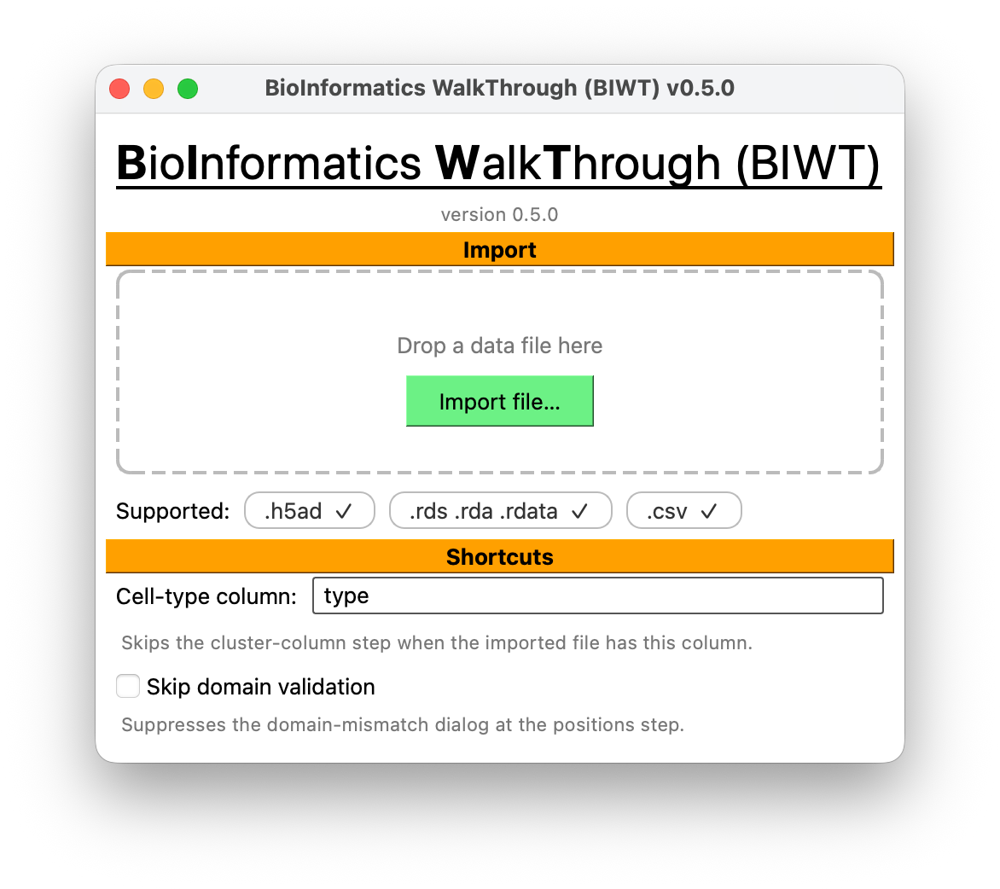

# Import data

The first screen has one button: **Import file…**. It offers `.h5ad`, `.rds`, `.rda`,
`.rdata`, and `.csv`.

<figure markdown>
  
  <figcaption>Everything else in the wizard follows from what you load here.</figcaption>
</figure>

## Cell parameter templates

This list is the [template library](cell-parameters.md) every import starts from. **Add files…**
puts a file on it; **Remove file…** takes one off. Your host's own files seed it, as ordinary
entries — remove one you do not want and it is gone for good.

The files are only named here; they are read at the cell-parameters step, so a file that cannot
be read is reported there.

## What BIWT reads from each format

| Format | Read via | Supported objects |
|---|---|---|
| `.h5ad` | `anndata.read_h5ad` | AnnData |
| `.rds` | `rpy2` + `anndata2ri` | Seurat, SingleCellExperiment, SpatialExperiment, SummarizedExperiment |
| `.rda` / `.rdata` | `base::load()` in R | Same, as the first object in the workspace |
| `.csv` | `pandas.read_csv` | A flat table, one row per cell |

Whatever the source, BIWT normalizes it to the same internal shape: a table of per-cell
metadata (`obs`), an optional array of spatial coordinates (`obsm`), and a cell count.

!!! note "`.rda` / `.rdata` files with several objects"
    BIWT takes the first object in the workspace. If you saved several objects together,
    re-save just the one you want.

## How spatial coordinates are found

BIWT looks for coordinates in two places, in order:

1. **An `obsm` spatial array** — the normal location for AnnData and SCE objects.
2. **Columns in `obs`** — checked in priority order: `x`/`y`/`z`-style names first, then, as
   a last resort, the 10x Visium pixel columns `imagecol` and `imagerow`.

The Visium fallback needs one adjustment: image rows increase *downward*, so `imagerow` is
flipped (`y = rowmax − imagerow`) to give a conventional y-up system. `imagecol` maps to x
directly.

When coordinates come from `obs` columns rather than an `obsm` array, BIWT synthesizes
`obsm["spatial"]` from them so the scatter plots on later screens have something to draw.

!!! note "Coordinates found this way are in *data units*"
    BIWT reports the extent in a generic `data unit` and infers no unit name from your file.
    Visium pixel coordinates in particular are not microns. Converting them is the job of the
    scale factor in [the domain editor](domain.md) — and Visium is the one case where BIWT
    can read the factor (µm per pixel) out of the file and pre-fill it for you.

## Probability columns

If your table has columns ending in `_probability` — for example `T_cell_probability`,
`Tumor_probability` — BIWT recognizes them as per-spot cell-type probabilities. Combined with
spatial coordinates, that unlocks the
[spot deconvolution step](spot-deconvolution.md).

## Re-importing

Importing a second file resets the whole session. Every choice you made about the previous
file — cluster column, merges, renames, counts, positions — is discarded. There is no partial
carry-over.

## When import fails

The error dialog tells you what failed and why. Failures fall into two groups:

**Something is wrong with the file.** Unsupported extension, malformed CSV, an R object of a
class BIWT does not handle, an empty R workspace. Fix the file.

**Something is wrong with your environment.** A missing optional dependency, or an R stack
that cannot load your object. These dialogs carry a link to the setup instructions, because
that is where the fix is:

- `anndata is required for .h5ad files` → install `biwt[anndata]`
- `rpy2 and anndata2ri are required for R files` → install `biwt[seurat]` **and** an R stack
  ([recipe](../getting-started/installation.md#seurat-rds-import-optional))
- `anndata2ri activation failed` → you have `anndata2ri` 2.0+;
  [pin it below 2](../getting-started/troubleshooting.md#6-anndata2ri-has-no-activate)
- `Failed to read … as R object` → usually `SeuratObject` missing from the R that `rpy2`
  bound to, or an ABI-mismatched R
  ([troubleshooting](../getting-started/troubleshooting.md#5-missing-seurat-r-packages))

A failed import leaves you on the import screen with nothing loaded, so you can fix the
problem and try again without restarting.

## Next

[Spot deconvolution →](spot-deconvolution.md) if your data has probability columns and
coordinates; otherwise [cluster column →](cluster-column.md).
