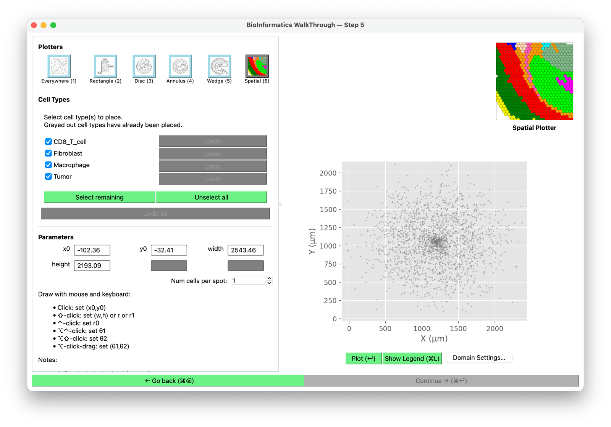
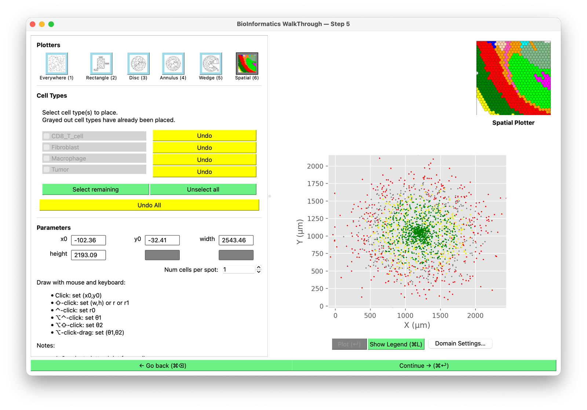

# Positions

**Shown when:** always. This is where cells actually get coordinates, and the most involved
screen in the wizard.

## The shape of it

Three regions: a **Plotters** strip along the top-left, a **Cell Types** list with placement
controls below it, and a live plot on the right.

<figure markdown>
  
  <figcaption>Before placing. All types are ticked, the plot previews the incoming
  coordinates in grey, and <strong>Continue</strong> is disabled until something is
  placed.</figcaption>
</figure>

Placing is a deliberate action, not something that happens on arrival:

1. **Tick the cell types** you want to place — or **Select remaining** for everything not yet
   placed.
2. **Choose a plotter** (below) and set its parameters, by typing numbers or by drawing on
   the plot.
3. **Click Plot (↵)**.

The ticked types are placed, their rows grey out with "already been placed", their **Undo**
buttons light up, and the plot redraws them coloured by type. **Continue** becomes available.

<figure markdown>
  
  <figcaption>After placing. Types are greyed as done, per-type Undo is live, and the plot
  shows the placement coloured by cell type.</figcaption>
</figure>

Because placement is per-selection, you can build an initial condition in passes: place the
tumour with one plotter, then the immune populations with another.

## The plotters

Six ways to decide *where* the selected cells go:

Six ways to decide *where* the selected cells go. Three of them are named for the shape they
make, so they are renamed when the domain is 3-D:

| Plotter | 2-D | 3-D | Places cells… |
|---|---|---|---|
| **(1)** | Everywhere | Everywhere | Randomly across the whole domain |
| **(2)** | Rectangle | **Box** | Randomly within a rectangle/box you specify |
| **(3)** | Disc | **Sphere** | Randomly within a circle/sphere |
| **(4)** | Annulus | **Spherical Shell** | Between an inner and an outer radius |
| **(5)** | Wedge | Wedge | Within an angular sector |
| **(6)** | Spatial | Spatial | At the coordinates from your data |

The number is the keyboard shortcut. **Wedge** keeps its name in 3-D even though it becomes a
spherical sector, and the toolbar icons stay flat in both cases — the "Box" button shows a
rectangle.

**Spatial** is the one that uses your file's geometry; the other five are synthetic regions
you define. That makes this screen useful even for non-spatial data — you are not limited to
"scattered uniformly", you can build structure by placing different types into different
regions.

### In a 3-D domain

There is no 2-D/3-D switch. BIWT decides from the domain's z extent: **3-D means
`zmax - zmin` greater than 20 µm**, one default PhysiCell voxel. The stock domain is ±10 µm in
z, exactly 20, so it is 2-D — you get a 3-D screen only after widening z in
[the domain editor](domain.md), and doing so mid-session rebuilds the plot in place.

Each shape then gains the parameters it needs: every one gets a `z0`, **Box** adds `depth`,
and **Wedge** adds a second pair of angles `ϕ1`, `ϕ2` (defaulting to 0° and 45°, and accepted
only in 0–180°) alongside `θ1`, `θ2`.

### Setting a region

The **Parameters** box holds the numbers for the active plotter — `x0`, `y0`, `width`,
`height` for a rectangle, radii and angles for the disc/annulus/wedge. Type them directly, or
draw on the plot:

- **Click** — set `(x0, y0)`
- **⇧-click** — set `(w, h)`, or `r` / `r1`
- **^-click** — set `r0`
- **⌥^-click** / **⌥⇧-click** — set `θ1` / `θ2`
- **⌥-click-drag** — set `θ1, θ2` together

Drawing is available per plotter, not everywhere. In a **3-D** domain, Box, Sphere, Spherical
Shell and Wedge are keyboard-entry only — type the numbers. Spatial keeps its mouse handling in
both 2-D and 3-D.

### Num cells per spot

Places more than one cell at each coordinate. Mainly for spot-based data where one row
represents a patch of tissue containing several cells — see
[spot deconvolution](spot-deconvolution.md) for the case where the mixture is known per spot.

The extra cells are scattered in a disc around the recorded coordinate, in the z = 0 plane —
including in a 3-D domain, where they will not be spread through the depth.

## How spatial placement transforms your data

When the **Spatial** plotter is used, coordinates are transformed by a **uniform scale and a
translation** — nothing else:

1. Coordinates are multiplied by the effective scale factor (see
   [the domain editor](domain.md)).
2. The resulting bounding box is centered in the domain.

Because the scale is uniform, aspect ratio is always preserved. A circular tumour stays
circular, and distances between any two cells scale by the same amount.

!!! note "The cells may not fill the domain"
    If your data's aspect ratio differs from the domain's, the cells occupy a
    correctly-proportioned region inside it rather than stretching to the edges. Distorting
    tissue geometry to fill a box would corrupt exactly the spatial relationships you chose
    to preserve.

    Resizing the domain changes the container, not the cell scale. To change how large the
    cells are relative to the domain, change the scale factor.

## The domain editor may open on its own

The first time this screen appears, BIWT compares your data's extent to the domain and opens
[the domain editor](domain.md) if the fit looks wrong in one of two ways:

- **outside** — some cells fall beyond the domain boundary and would be excluded
- **small** — the cells fit but cover less than half of an axis or half the area, so they
  would sit as a small island in a large empty box

It opens once. Navigating back and forward does not re-trigger it, and you can suppress it
with the **Skip domain validation** checkbox on the [import screen](import.md). Reopen it any
time with **Domain Settings…**.

## Undo

**Undo** per cell type, or **Undo All**. Domain changes are undoable too: changing the domain
recomputes the default placement while preserving any manual edit as an undo step, so
experimenting with domain sizes does not silently discard your work.

## Out-of-bounds cells

If cells end up outside the domain, BIWT warns and offers to either clear the placement or
keep it. Keeping them is legitimate — some hosts cull out-of-bounds cells, some clamp them —
but it should be your decision rather than something you discover later.

## Next

[Cell parameters →](cell-parameters.md).
