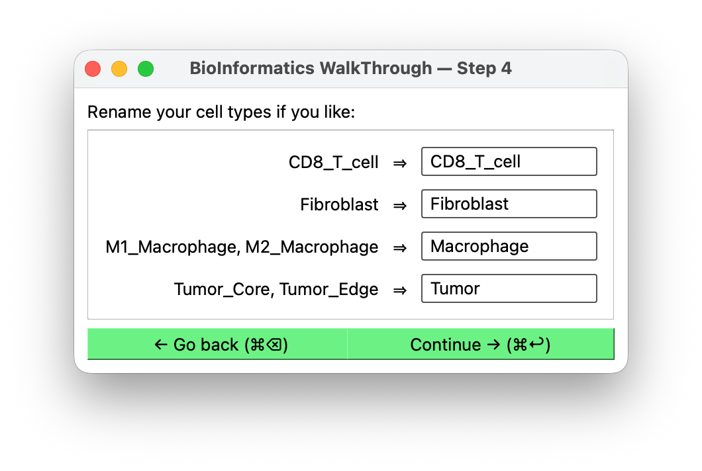

# Rename cell types

**Shown when:** always.

## The question

Each cell type that survived the [edit step](edit-cell-types.md) gets a text field,
pre-filled with its first original name. Change any of them, or accept them all.

<figure markdown>
  
  <figcaption>Original name on the left, the name that will reach your simulation on the
  right.</figcaption>
</figure>

The names you set here appear in the `type` column of the output, in
[`cell_type_map`](result.md), and as the keys of
[`cell_templates`](cell-parameters.md). Whether they become cell definitions in a
simulation config is the host's decision — BIWT generates none.

## Why bother

Two reasons.

**Cluster IDs are not names.** If you selected a `seurat_clusters` column, your types are
currently `0`, `1`, `2`. A config full of `<cell_definition name="7">` is unreadable and
unmaintainable.

**Matching the host's existing definitions.** If your simulation config already defines a
`tumor` cell type, naming yours `tumor` lets them line up instead of creating a near-duplicate.

## Suggestions from the host

If the host application passed BIWT its current cell-type names — Studio does this from its
cell-definitions tab — BIWT looks for a match and offers it as **placeholder text** in each
field.

A case-insensitive exact match wins outright. Failing that, BIWT compares the names for
similarity and takes the first host name it accepts, in alphabetical order — so `Fibroblasts`
matches a host `Fibroblast`, but nothing is ranked and you get the first acceptable name, not
the best one.

Digits are treated as significant rather than as spelling noise, so `M1 Macrophage` is never
suggested for `M2 Macrophage`, nor a `CD4` type for a `CD8` one, even though those names are
otherwise near-identical. Pairs distinguished by a non-numeric qualifier — `PD-1hi` versus
`PD-1lo` — are not caught; a host with names of that shape can supply its own comparison via
`BiwtInput.name_matches`, which replaces BIWT's rule entirely.

Placeholder text only shows in an *empty* field, and every field arrives pre-filled with your
original name — so in practice the suggestion sits hidden behind it. Clear a field and it
appears, grayed out, as `Suggestion: <host name>`.

It is a hint either way: nothing is filled in for you, so if you want the suggested name you
have to type it. Note that an empty field is accepted as an empty name — only duplicates are
blocked — so do not leave one cleared just to keep the hint in view.

## Naming rules

**Exact duplicates are blocked.** Two types cannot share a name; BIWT warns and keeps you on
the screen.

**Case matters.** `CD8` and `cd8` are treated as different names and both are allowed,
because PhysiCell treats them as distinct. This is easy to do by accident — if you meant them
to be the same type, merge them at the [previous step](edit-cell-types.md) instead.

!!! tip "Pick names your config can live with"
    Avoid spaces and punctuation if your downstream tooling is picky about XML attribute
    values. `CD8_T_cell` travels better than `CD8+ T cell (exhausted)`.

## Next

[Cell counts →](cell-counts.md) if you are not using spatial data; otherwise
[positions →](positions.md).
