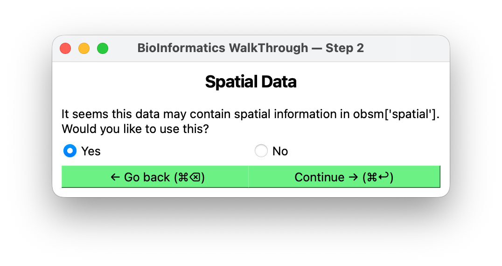

# Spatial query

**Shown when:** BIWT found spatial coordinates in your data. If it found none, there is
nothing to ask and this screen is skipped — placement will be random.

## The question

"Use the spatial coordinates from the data?" Yes or no. The prompt names *where* it found
them, which is worth reading: BIWT checks `obsm` first, then `obs`/CSV columns, and some of
the places it looks are more trustworthy than others.

<figure markdown>
  
  <figcaption>Note that the prompt names where the coordinates were found — worth reading
  before you answer.</figcaption>
</figure>

| Source named in the prompt | Usually holds | Use it? |
|---|---|---|
| `obsm['spatial']`, `obsm['X_spatial']`, `obsm['spatial_coords']` | The conventional slot for tissue coordinates — Visium, Xenium, MERFISH | Yes — this is what it is for |
| Any other `obsm` key containing `spatial` or `coord` | Whatever its author put there: `tissue_coords`, but `X_umap_coords` matches too | Check the name before trusting it |
| `obs` columns `spatial_x`, `x_coord`, `coord_x`, `x_centroid`, `cell_x` (and `y`/`z` equivalents) | Columns whose name says "coordinate" — segmentation centroids, exported spatial tables | Yes |
| `obs` columns `x`, `y`, `z` | Anything at all — the most generic match BIWT makes | Usually, but this is where an embedding can hide |
| `obs` columns `imagecol`, `imagerow`, shown as *(image columns)* | Visium pixel positions, flipped to y-up | Yes, but set the scale factor in [the domain editor](domain.md) |

Embeddings stored under their conventional names — `X_umap`, `X_tsne`, `X_pca` — are **not**
matched, so a UMAP sitting alongside real coordinates is never picked up by mistake.

## Yes — place cells where the data says

Cells are placed at their recorded positions, uniformly scaled and centered to fit the
domain. Relative geometry is preserved exactly: a tumor core stays a core, an immune margin
stays a margin, and the ratio of any two distances is unchanged.

Consequences:

- **Cell counts follow from the data.** One cell per row, so the
  [cell counts](cell-counts.md) screen is skipped. You cannot ask for "500 tumor cells" here
  — you get however many the data has, minus any types you delete at the
  [edit cell types](edit-cell-types.md) screen.
- **The [domain editor](domain.md) becomes relevant.** How your data's extent maps onto the
  simulation box is now a real decision, and BIWT will raise it at the
  [positions](positions.md) screen if the fit looks wrong.

## No — place cells randomly

Cells are distributed at random within the domain. Their type composition is preserved, but
their positions are not.

Consequences:

- **You choose the counts.** The [cell counts](cell-counts.md) screen appears, with four ways
  to specify how many cells of each type to place.
- **Coordinates in the file are ignored entirely.**

## Which to pick

Say **yes** when spatial arrangement is part of what you are modeling — tumor–immune
architecture, spatial gradients, anything where "where the cells are" is the point.

Say **no** when the arrangement is not meaningful, or you do not want it. Two common cases:

- The prompt named a source you do not trust — see the table above. Placing cells at the
  positions of a **dimensionality-reduction embedding** gives you a picture of the embedding,
  not of tissue.
- You want a **synthetic population** with realistic composition but a controlled size —
  seeding a simulation with 2,000 cells in the observed proportions rather than the 40,000 in
  your dataset.

Either way the [positions](positions.md) step previews the result, and you can come back and
change this answer.

## Next

[Edit cell types →](edit-cell-types.md).
